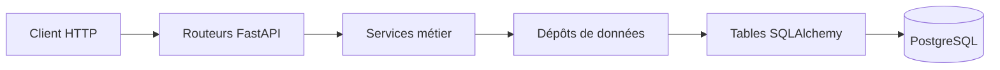

# API Catalogue de jeux

API REST de gestion d'un catalogue de jeux vidéo, construite avec FastAPI et PostgreSQL.

## Prérequis

- Docker Desktop avec Docker Compose (pour le démarrage recommandé).
- Python 3.12 ou supérieur si vous souhaitez lancer les commandes Python ou l'API hors de Docker.
- PostgreSQL 16 si vous lancez l'API hors de Docker.

## Démarrage rapide

À la racine du dépôt, copiez le fichier de configuration d'exemple :

```powershell
Copy-Item .env.example .env
```

Sur macOS ou Linux :

```bash
cp .env.example .env
```

Dans `.env`, remplacez `CLE_SECRETE` par une valeur générée, par exemple avec :

```bash
python -c "import secrets; print(secrets.token_urlsafe(32))"
```

Ne réutilisez pas une clé de développement en production et ne partagez jamais votre fichier `.env`.

Construisez et démarrez l'API ainsi que PostgreSQL :

```bash
docker compose up --build
```

Quand les conteneurs démarrent, ouvrez <http://localhost:8000/docs>. La documentation interactive de l'API doit s'afficher. Pour arrêter les conteneurs, utilisez `Ctrl+C`, puis :

```bash
docker compose down
```

## Configuration

Les noms ci-dessous sont ceux à utiliser dans `.env`. Les deux premières variables sont obligatoires lorsque l'API est lancée directement sur votre machine. Avec Docker Compose, l'URL de la base de données est fournie au conteneur par `docker-compose.yml`.

| Variable | Rôle | Obligatoire | Valeur par défaut |
|---|---|---:|---|
| `DATABASE_URL` | URL de connexion SQLAlchemy à PostgreSQL. | Oui, hors Docker Compose | Aucune |
| `CLE_SECRETE` | Clé utilisée pour signer les jetons d'authentification. À garder secrète. | Oui | Aucune |
| `ALGORITHME_JETON` | Algorithme de signature des jetons. | Non | `HS256` |
| `DUREE_JETON_MINUTES` | Durée de validité d'un jeton, en minutes. | Non | `30` |
| `ORIGINES_AUTORISEES` | Origines autorisées par CORS ; plusieurs origines peuvent être séparées par des virgules. | Non | `http://localhost:5173` |
| `ENVIRONNEMENT` | Nom de l'environnement d'exécution. | Non | `developpement` |
| `NIVEAU_JOURNAL` | Niveau des journaux de l'application. | Non | `INFO` |
| `ECHO_SQL` | Active l'affichage des requêtes SQL. | Non | `false` |
| `MAX_TENTATIVES_CONNEXION` | Nombre maximal de tentatives de connexion dans la fenêtre définie. | Non | `5` |
| `FENETRE_TENTATIVES_MINUTES` | Durée de la fenêtre de limitation, en minutes. | Non | `15` |

Pour un lancement hors de Docker, configurez `DATABASE_URL` avec l'URL de votre base PostgreSQL, puis démarrez l'application avec `fastapi dev app/main.py`.

## Utilisation

L'API est préfixée par `/api/v1`. Une fois le serveur démarré, la documentation interactive est disponible sur <http://localhost:8000/docs>.

Lister les jeux :

```powershell
Invoke-RestMethod http://localhost:8000/api/v1/jeux
```

Lire les statistiques du catalogue :

```powershell
Invoke-RestMethod http://localhost:8000/api/v1/jeux/statistiques
```

Vérifier que l'API et sa base de données répondent :

```powershell
Invoke-RestMethod http://localhost:8000/api/v1/sante
```

Sous macOS ou Linux, vous pouvez remplacer `Invoke-RestMethod URL` par `curl URL`.

## Tests

Installez les dépendances de développement, puis lancez les tests et le linter depuis la racine du dépôt :

```bash
python -m pip install -r requirements-dev.txt
python -m pytest
ruff check .
```

Les tests doivent se terminer sans échec et Ruff doit afficher `All checks passed!`.

## Architecture



Les dossiers principaux :

- `app/routeurs/` : reçoit les requêtes HTTP et appelle les services.
- `app/services/` : porte les règles métier.
- `app/depots/` : lit et écrit les données avec SQLAlchemy.
- `app/tables/` : définit les tables de la base de données.
- `app/modeles/` : définit les données validées et les réponses de l'API.
- `tests/` : contient les tests automatisés.

## Contribuer

1. Ouvrir ou choisir une issue pour décrire le changement.
2. Mettre `main` à jour et créer une branche dédiée à l'issue, par exemple `fix/12-statistiques`.
3. Faire des commits courts avec un message qui décrit chaque intention.
4. Pousser la branche et ouvrir une pull request vers `main`, en expliquant le contexte, les changements, l'impact et les vérifications.
5. Demander une relecture, répondre aux commentaires et attendre l'approbation avant de fusionner la pull request.
6. Supprimer la branche après la fusion.
